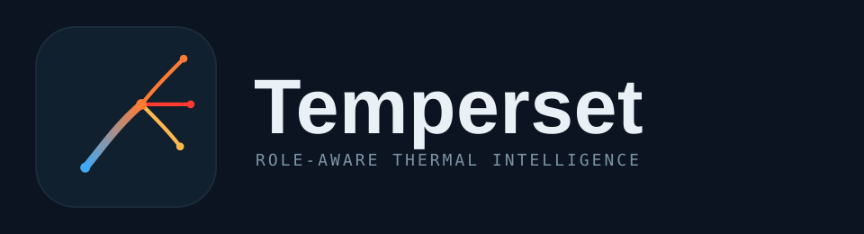
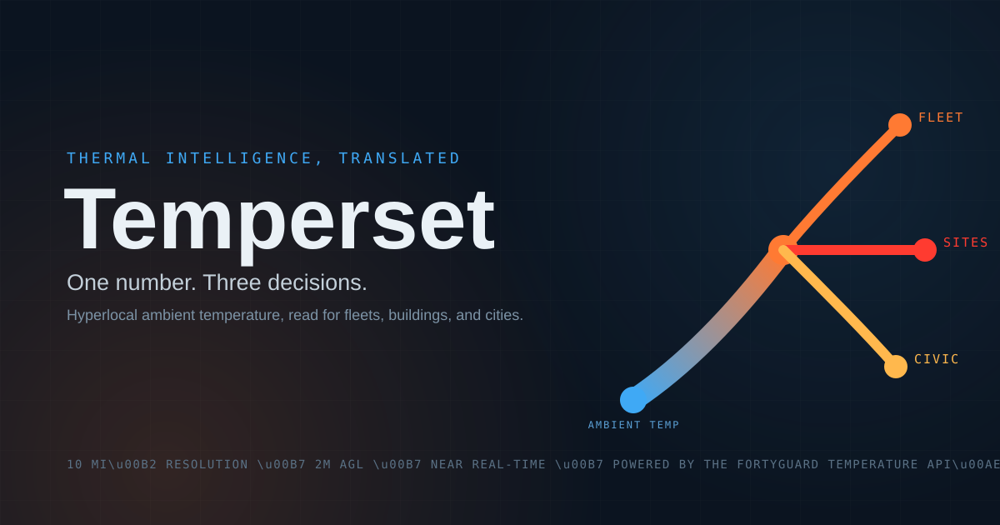

# Temperset — Temperature, Translated.

<p align="center">
  
</p>

<p align="center">
  <strong>The Operating System for Heat.</strong><br/>
  One heat data layer. Infinite operational decisions. Temperset translates the same hyperlocal temperature into role-specific actions — for logistics, data centers, city planners, architects, airlines, and everyone in between.
</p>

<p align="center">
  
</p>

<p align="center">
  Built for <strong>FortyGuard Hackathon '26 — Building the World's Temperature AI</strong>
</p>

---

## The Problem

Weather apps tell you the temperature of your city. They can't tell you that one side of the street is 8°F hotter than the other, that driver heat-stress risk peaks between 12pm and 4pm on the I-10 corridor, or that density altitude at Phoenix SkyHarbor will exceed 5,500ft after 2pm — restricting flight payloads.

Existing heat data is either:
- **Too coarse** — city-wide averages that miss the street-level reality
- **Too generic** — the same 100°F means completely different things to a truck driver, an architect, and a city planner, but every platform treats it the same
- **Too siloed** — logistics teams, building operators, and government planners each buy separate tools that all use the same underlying data

The **FortyGuard Temperature API®** delivers hyperlocal, 2-meter-above-ground, near-real-time ambient temperature at 10mi² resolution — but the data alone doesn't make decisions. It needs translation.

---

## Our Solution: Temperset

**Temperset is a role-aware thermal intelligence platform.** It takes FortyGuard's hyperlocal temperature data and translates the same number into different operational decisions depending on who's looking.

### The Core Insight

> **Same temperature, different decisions.**

| Who's Looking | What 100°F Translates To |
|---|---|
| Logistics Manager | "Driver heat-stress windows 12pm–4pm, reroute via I-8, save 2.3 hrs cooling breaks" |
| Architect | "Spec changes: thermal expansion +0.8mm on south facade, recommend albedo 0.65 coating" |
| City Planner | "Heat equity gap: District 7 runs 6°F hotter, 3 cooling centers needed within 0.5mi" |
| Airline Ops | "Density altitude at PHX exceeds 5,500ft after 14:00, payload restrict flight 2241" |
| Road Contractor | "Asphalt curing window closes 13:30, reschedule paving to 05:00–10:30" |
| Data Center Ops | "Free cooling available 02:00–06:00, save $4,200 in chiller load tonight" |
| Public Health | "ER visits projected up 23% in Zip 85003, declare heat advisory by 11:00" |

This is genuinely novel — no existing platform does role-aware heat translation. It also explains why we merged all 7 hackathon tracks: each track is one translation perspective on the same thermal truth.

### Tagline

**Temperature, Translated.** — short, defensible, instantly explains the product.

---

## How It Works

### 1. The Wheel as Metaphor

The landing page centers on a slowly rotating wheel with all 7 hackathon tracks as nodes orbiting a thermal core. The wheel isn't just navigation — it's the brand: *"Heat is the center. You orbit it. Pick your angle."*

- Slow rotation (~80 seconds per full turn) — readable, hypnotic, on-brand
- Hover pauses the wheel on that category
- Click spins into a deep-dive view with role-curated insights
- Pointer at top indicates the "current" position (like a roulette)
- Tick marks around the perimeter add depth and precision

### 2. The Onboarding Lens

On first visit, users pick from 16 roles across 5 groups:

- **Individual** — Resident
- **Enterprise** — Logistics, Data Center, Retail, Airline, Energy, Real Estate, Agriculture
- **Government** — Urban Planner, Public Health, Emergency Services
- **Non-Profit** — Climate NGO
- **Professional** — Architect, Road Constructor, ML Researcher

Each role has priority categories, temperature thresholds, and sample insights. The platform remembers the role (via `localStorage`) and tailors every subsequent view.

### 3. Role-Aware Translation

When a user opens a category deep-dive, Temperset shows the same temperature data with role-specific translations. If the user is a Logistics Operator opening Industrial & Enterprise, the platform highlights the logistics translation with a "Your lens" badge and the AI chatbot persona incorporates logistics-specific thresholds (driver heat stress at 95°F, cargo risk at 110°F).

### 4. Per-Category AI Analyst

Each of the 7 tracks has its own chatbot persona powered by **Groq's Llama 3.3 70B** (free, OpenAI-compatible). The system prompt combines:
- The category's persona (e.g., "Industrial & Enterprise analyst — translate temperature into dollars, hours, and risk thresholds")
- The user's role thresholds
- The user's current location and temperature
- Strict formatting rules (max 180 words, lead with actionable insight, cite specific numbers, end with a 4-hour recommendation)

### 5. Real-Time Data Layer

- **Temperature** — FortyGuard API (real when key is configured, deterministic mock otherwise)
- **News** — NewsAPI.org primary, GDELT Project silent fallback (free, no key)
- **Maps** — OpenStreetMap + Leaflet (free, open source) for heat visualization
- **Database** — Supabase Postgres (free, hosted, works on both local and Vercel)

---

## Features

### Landing Page
- **Dynamic sky background** — shifts by time-of-day (dawn/day/sunset/night) with sun arc, drifting clouds, twinkling stars, and a city skyline silhouette with lit windows at night
- **Manual sky override** — "Next Sky" button beside the wheel cycles through dawn → day → sunset → night → auto
- **Rotating category wheel** — 7 tracks orbit a thermal core, slow rotation, hover-pause, click-to-dive, tick marks, top pointer, click-spin effect
- **Top-left Heat Pulse widget** — live ticker of 12 US cities (Phoenix, Las Vegas, Miami, etc.) with expandable panel showing peak temps and heat-island deltas
- **Top-right News Radar widget** — aggregates heat news across all 7 tracks via NewsAPI
- **Onboarding modal** — 16 roles across 5 groups, 4-step flow (welcome → role → details → sample insight)

### Category Deep-Dive (per track)
- Hero band with track gradient, icon, track number, and tagline
- Live temperature readout — current, peak, and heat-island delta
- Role-curated translations — same temperature, different decisions per role (user's role highlighted with "Your lens" badge)
- Interactive heat map (Track 1: Resilient Cities & Track 4: Government only) — Leaflet + OpenStreetMap with concentric heat tiles, cool corridor suggestions, and vulnerability zones
- Per-category news feed — NewsAPI-sourced headlines relevant to the track
- Floating AI chatbot — per-track LLM persona with role-tuned system prompt and quick-suggestion chips

### Persistence
- Profile saved to Supabase Postgres via Prisma ORM
- Client state via Zustand `persist` middleware (localStorage for role + view state)
- API caching — temperature cached 5min, news cached 30min

---

## Tech Stack

| Layer | Technology |
|---|---|
| Framework | Next.js 16 (App Router) |
| Language | TypeScript 5 |
| Styling | Tailwind CSS 4 |
| UI Components | shadcn/ui (New York style) + Lucide icons |
| Animations | Framer Motion |
| State | Zustand (client) + TanStack Query (server) |
| Database | Prisma ORM + Supabase Postgres |
| Maps | Leaflet + react-leaflet + OpenStreetMap |
| LLM | Groq Llama 3.3 70B (free, OpenAI-compatible) |
| Temperature Data | FortyGuard Temperature API® |
| News | NewsAPI.org (primary) + GDELT Project (fallback) |
| Deployment | Vercel |

---

## APIs Used (All Free)

Temperset is built entirely on free-tier APIs. **Total cash outlay: $0.**

| API | Purpose | Env Var | Free Tier |
|---|---|---|---|
| **FortyGuard Temperature API®** | Core heat data (2m ambient, 10mi², real-time + 12hr forecast) | `FORTYGUARD_API_KEY` | Free during hackathon + trial credits |
| **Groq Llama 3.3 70B** | 7 category chatbots + role curation | `GROQ_API_KEY` | Free, ~30 req/min, no credit card |
| **Supabase Postgres** | Hosted database | `DATABASE_URL` + `DIRECT_DATABASE_URL` | Free 500MB, 50k MAU |
| **NewsAPI.org** | Primary news source | `NEWS_API_KEY` | 100 req/day, 1-month history |
| **GDELT Project** | Silent news fallback | (none) | Unlimited |
| **OpenStreetMap + Leaflet** | Map rendering | (none) | Unlimited |
| **US Census** | Demographics for heat equity | `CENSUS_API_KEY` | Free, unlimited |
| **OpenRouteService** | Cool route planning (Track 1) | `ORS_API_KEY` | 2,000/day |
| **Resend** | Optional email alerts | `RESEND_API_KEY` | 3,000/month |
| **Vercel** | Hosting & deployment | (none) | 100GB bandwidth |

---

## Quick Start

```bash
# Clone the repo
git clone https://github.com/b3panda3/Temperset.git
cd Temperset

# Install dependencies
npm install

# Copy env example and fill in your keys
cp .env.example .env

# Generate Prisma client + push schema to Supabase
npx prisma generate
npx prisma db push

# Start the dev server
npm run dev
```

Open http://localhost:3000 — you should see the rotating wheel with a dynamic sky background.

---

## Local Development

### Prerequisites

- **Node.js 20+** — download from https://nodejs.org
- **npm** (ships with Node.js)

### Commands

```bash
npm install              # Install dependencies
npm run dev              # Start dev server on port 3000
npm run lint             # ESLint check
npx prisma db push       # Push schema changes to Supabase
npx prisma generate      # Regenerate Prisma client after schema changes
npm run build            # Production build (Vercel runs this automatically)
```

### Verifying It Works

After `npm run dev`, open http://localhost:3000. You should see:

1. A dynamic sky background (changes by time of day)
2. A slowly rotating wheel with 7 category nodes
3. Top-left: Heat Pulse widget showing live US city temps
4. Top-right: News Radar widget showing heat headlines
5. A "Next Sky" button beside the wheel to cycle backgrounds
6. After ~1.5 seconds, an onboarding modal appears prompting role selection

### Testing Core Flows

1. Click "Get Started" → pick a role → fill details → click "See My Insights"
2. Click "Enter Temperset" → you're back on the wheel with your role active
3. Click any wheel category (e.g., "Industrial & Enterprise") to open the deep-dive
4. Try the chatbot — ask "Reroute my drivers around heat today" as a Logistics Operator
5. Hover the "Next Sky" button to see the expanded sky picker
6. Scroll down to see the "Why Temperset is different" section

---

## Project Structure

```
temperset/
├── prisma/
│   └── schema.prisma                  # UserProfile, ChatMessage, SavedSearch, HeatAlert
├── public/
│   ├── temperset-logo.svg            # Full logo
│   ├── temperset-icon.svg            # Favicon + brand badge
│   ├── temperset-cover.svg           # OG/Twitter card image
│   └── leaflet-images/               # Map marker assets
├── src/
│   ├── app/
│   │   ├── layout.tsx                # Temperset metadata, dark theme, favicon
│   │   ├── page.tsx                  # Single-page orchestrator (the only route)
│   │   ├── globals.css               # Custom scrollbar, reduced-motion support
│   │   └── api/
│   │       ├── chat/route.ts         # Groq LLM chatbot
│   │       ├── temperature/route.ts  # FortyGuard proxy (with mock fallback)
│   │       ├── news/route.ts         # NewsAPI → GDELT → mock
│   │       └── profile/route.ts      # Profile persistence (Prisma + Supabase)
│   ├── components/
│   │   ├── ui/                       # shadcn/ui component library
│   │   └── temperset/
│   │       ├── SkyBackground.tsx     # Dynamic time-of-day sky + skyline
│   │       ├── BackgroundSwitcher.tsx # "Next Sky" button + picker
│   │       ├── CategoryWheel.tsx     # Rotating 7-track centerpiece
│   │       ├── HeatPulseWidget.tsx   # Top-left live US heat ticker
│   │       ├── NewsRadarWidget.tsx   # Top-right heat news radar
│   │       ├── OnboardingModal.tsx   # 16-role selector flow
│   │       ├── CategoryDeepDive.tsx  # Track-specific deep view
│   │       ├── TrackMap.tsx          # Leaflet wrapper (ssr: false)
│   │       ├── TrackMapInner.tsx     # Actual Leaflet map for tracks 1 & 4
│   │       ├── ChatbotWidget.tsx     # Per-category AI analyst
│   │       └── NewsSection.tsx       # Per-category news feed
│   └── lib/
│       ├── categories.ts             # 7 track definitions (personas, translations, colors)
│       ├── roles.ts                  # 16 role taxonomy (thresholds, priority categories)
│       ├── fortyguard.ts             # API client + deterministic mock
│       ├── news.ts                   # NewsAPI → GDELT → mock
│       ├── store.ts                  # Zustand persisted state
│       ├── db.ts                     # Prisma client
│       └── utils.ts                  # shadcn/ui utilities
├── .env.example                      # Full env var template
├── .env                              # Your local env (gitignored, never commit)
├── next.config.ts
├── package.json
├── tailwind.config.ts
└── tsconfig.json
```

---

## License

MIT.

---

## Credits

- **FortyGuard** — Temperature API®, hyperlocal urban heat intelligence (NVIDIA-recognized)
- **Groq** — Free, OpenAI-compatible LLM hosting (Llama 3.3 70B)
- **Meta** — Llama 3.3 70B (open-source LLM)
- **Supabase** — Hosted Postgres database
- **NewsAPI.org** — News aggregation API
- **GDELT Project** — Free global news API (fallback)
- **OpenStreetMap** — Free, open-source map data
- **Leaflet** — Open-source JavaScript map library
- **Next.js** — React framework
- **shadcn/ui** — Component library
- **Tailwind CSS** — Styling
- **Framer Motion** — Animations
- **Prisma** — ORM
- **Vercel** — Deployment platform

---

**Built for FortyGuard Hackathon '26 — Building the World's Temperature AI.**
